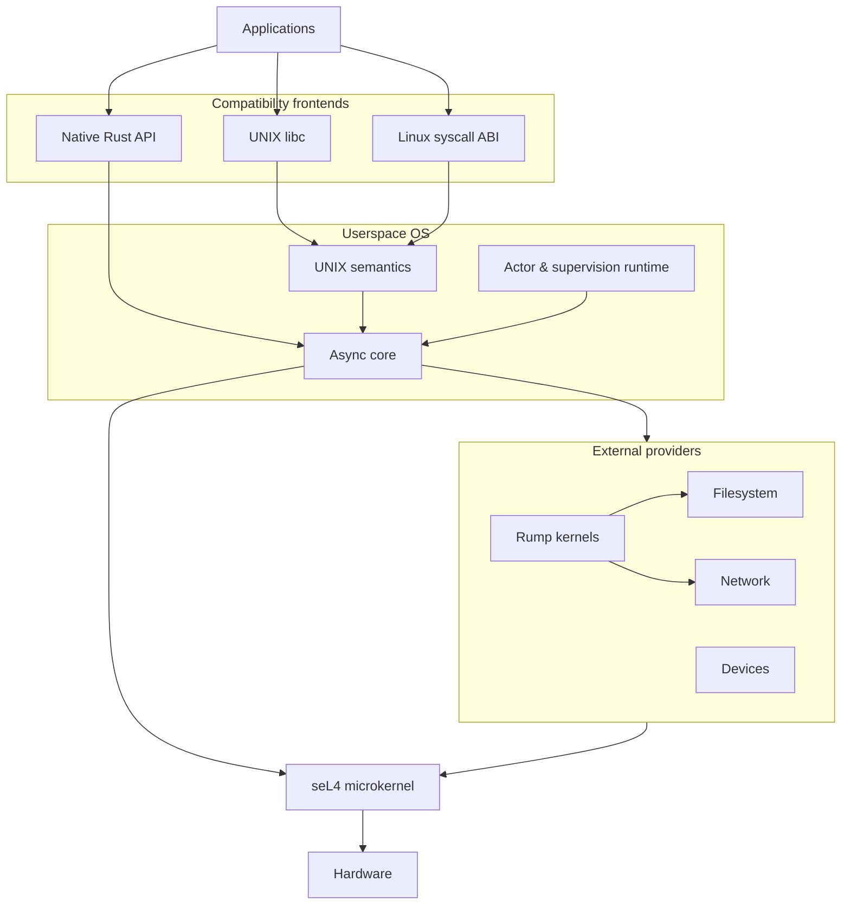

# Ricoq Operating System (OS)

This is the source code for RicoqOS, an operating system runtime based on the
seL4 microkernel. We aim to implement formal proof inside our code using Verus.

## Architecture

seL4 remains the only privileged kernel on RING0. Everything above it is a
userspace component and may therefore be isolated, restarted, or replaced.

## Core concepts

* Async-native execution. The runtime is asynchronous by construction.
* UNIX compatibility. The project provides a derived libc replacing syscalls
    with direct calls into the userspace runtime.
* Actor model. Isolation and fault tolerance inspired by OTP.
